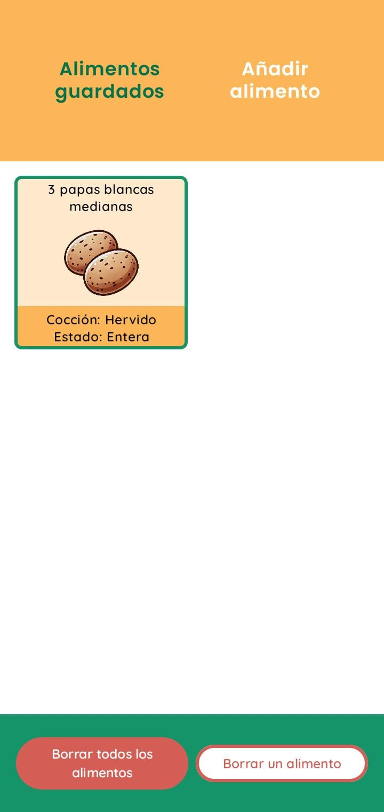
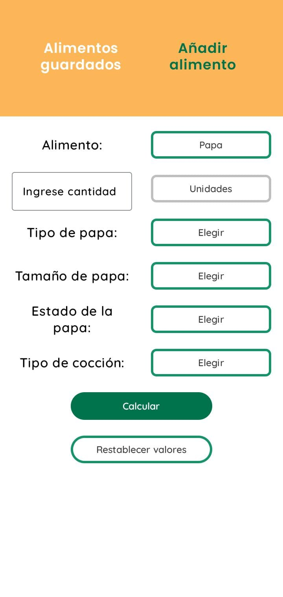

# Chef Alarm: Gestor de tiempos de cocción
Esta aplicación permite a los usuarios gestionar los tiempos de cocción de diferentes alimentos de manera sencilla y precisa. Basándose en la cantidad de ingredientes, la app calcula automáticamente el tiempo necesario y genera alarmas para avisar cuando la cocción ha finalizado.

## Características principales
1. Cálculo automático del tiempo de cocción, según las elecciones del usuario.
2. Configuración automática de alarmas.
3. Interfaz sencilla y optimizada para su uso en la cocina.

    
    

## Instalación
Ingresar a [esta página](https://github.com/Asflum99/Chef-Alarm/releases), descargar el archivo llamado "chef-alarm.apk" e instalarlo en el celular Android.
